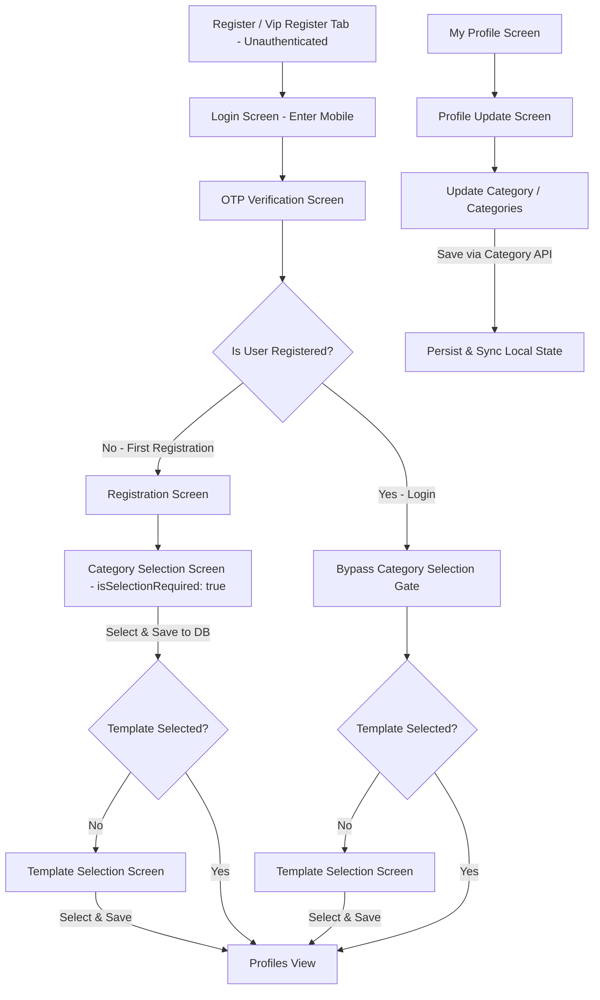

# Application Flow Rules

This document outlines the mandatory authentication, registration, setup, and profile edit flow. The agent must adhere to and respect these rules when modifying onboarding, login, registration, or screen routing in the app.

---

## Authentication, Registration & Category Flow

The user onboarding, login, and category management flow for both **Normal** and **VIP** registers is defined as follows:

### 1. Direct Login (Unauthenticated State)
- **Behavior**: When unauthenticated users access the Register or Vip Register tab, directly show the Login screen without any initial dummy category preview.
- **Back Button**: When embedded in the main tab navigation, the back button is hidden.

### 2. Login Flow (Existing Registered Users)
- **Login**: User enters their mobile number / Google Sign-In and completes OTP verification.
- **Category Gate Bypassed**: Existing users logging in are **NOT** asked to select a category. The category gate is bypassed, allowing them to proceed directly to the template check or Partner Profiles screen.

### 3. First-Time Registration Flow (Mandatory Gatekeeping)
When a user completes registration for the first time:
1. **Category Selection**:
   - The user must be sequentially gated to select a category (`NormalCategoryScreen` / `VipCategoryScreen` with `isSelectionRequired: true`).
   - Once selected, save choice via the Category Selection API before proceeding.
2. **Template Selection**:
   - Check if a profile template is selected.
   - If not selected: Show the Template Selection screen. Once selected, save choice.
   - If selected: Proceed to the main profiles screen.

### 4. Category Updation in Profile Edit Screen
- Users can view and update their category/categories at any time from the **Profile Update Screen** (`ProfileUpdateScreen`).
- **VIP Profile**: Single category selection corresponding to VIP tiers.
- **Normal Profile**: Category selection supporting multiple/single categories.
- Updating category in the Profile Update screen persists the change via the Category Selection API (`VipCategoryService` / `NormalCategoryService`) and updates local state in `ProfileProvider` and `CategoryProvider`.

---

## App Initialization / App Restart Verification Rule

Whenever the application initializes, restores session, or recovers from a background/restart state:
- For authenticated existing sessions, verify that the template requirement is satisfied before displaying the Partner Profiles view.
- Category requirement is strictly enforced only on first-time registration completion and remains editable from the user's Profile screen.
