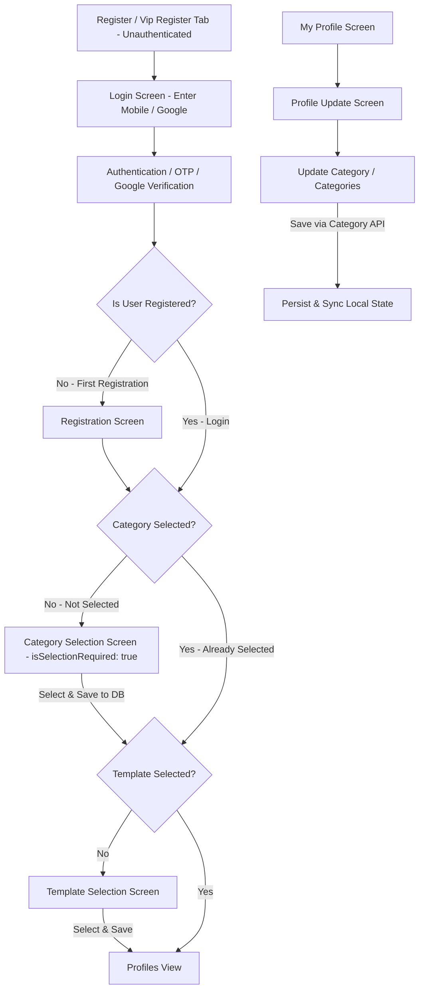

# Application Flow Rules

This document outlines the mandatory authentication, registration, setup, and profile edit flow. The agent must adhere to and respect these rules when modifying onboarding, login, registration, or screen routing in the app.

---

## Authentication, Registration & Category Flow

The user onboarding, login, and category management flow for both **Normal** and **VIP** registers is defined as follows:

### 1. Direct Login (Unauthenticated State)
- **Behavior**: When unauthenticated users access the Register or Vip Register tab, directly show the Login screen without any initial dummy category preview.
- **Back Button**: When embedded in the main tab navigation, the back button is hidden.

### 2. Mandatory Sequential Progression (Category -> Template -> Profiles)
- **Category Gate (Mandatory Pre-condition)**: At initial registration, after login, or after app restart, if a user has **NOT** selected a category, they **MUST** select a category first (`NormalCategoryScreen` / `VipCategoryScreen` with `isSelectionRequired: true`).
- **Template Gate**: Only **AFTER** a category is selected (and saved to DB/session), the user proceeds to the Template check.
  - If a template is not selected: Display the Template Selection screen (`MyTemplateScreen(isGate: true)`).
  - If a template is selected: Advance to the Partner Profiles view (`PartnerFullScreenView`).

### 3. Category Updation in Profile Edit Screen
- Users can view and update their category/categories at any time from the **Profile Update Screen** (`ProfileUpdateScreen`).
- **VIP Profile**: Single category selection corresponding to VIP tiers.
- **Normal Profile**: Category selection supporting multiple/single categories.
- Updating category in the Profile Update screen persists the change via the Category Selection API (`VipCategoryService` / `NormalCategoryService`) and updates local state in `ProfileProvider` and `CategoryProvider`.

---

## App Initialization / App Restart Verification Rule

Whenever the application initializes, restores session, or recovers from a background/restart state:
- **Category check first**: Verify if category selection is fulfilled. If unselected, route/render the Category Selection Screen.
- **Template check second**: Verify if template requirement is satisfied before displaying the Partner Profiles view.
