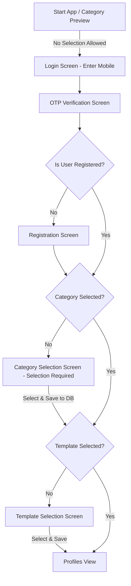

# Application Flow Rules

This document outlines the mandatory authentication, registration, and setup flow. The agent must adhere to and respect these rules when modifying onboarding, login, registration, or screen routing in the app.

---

## Authentication & Registration Flow

The user onboarding and onboarding recovery flow is identical for both **Normal** and **VIP** registers.

### 1. Pre-Login Preview (Categories Screen)
- **Behavior**: Show the categories list to the user as a preview.
- **Constraints**:
  - **No selection is allowed** at this stage.
  - The `+` buttons or selection checkmarks/indicators must **not** be visible.
  - Tapping cards must be disabled (`onTap` set to `null`).
  - Action button label: **"Next"** (navigates to the Login flow).

### 2. Login & OTP Verification
- **Login**: User enters their mobile number.
- **OTP Screen**: Verifies the code.
- **Registration check**:
  - If **not registered**: Redirect the user to the Register page.
  - If **already registered**: Check database state to restore/determine progress.

### 3. Onboarding Steps Completion (Mandatory Gatekeeping)
Once registered, the app must sequentially verify and gate the user through the following setup steps before they can view partner profiles:

1. **Category Selection**:
   - Check if a category is selected in the database.
   - If **not selected**: Show the Category Selection screen (with `isSelectionRequired: true`). Once selected, save choice via API.
   - If **selected**: Proceed to template check.
2. **Template Selection**:
   - Check if a profile template is selected.
   - If **not selected**: Show the Template Selection screen. Once selected, save choice.
   - If **selected**: Proceed to the main profiles screen.

---

## App Initialization / App Restart Verification Rule

Whenever the application initializes, restores session, or recovers from a background/restart state:
- The app **must verify** that the complete sequence is fully satisfied (Registered -> Category Selected -> Template Selected) before displaying the Partner Profiles view.
- Until all requirements are met, the corresponding onboarding screen for that step must block the user. This is a mandatory gate.
