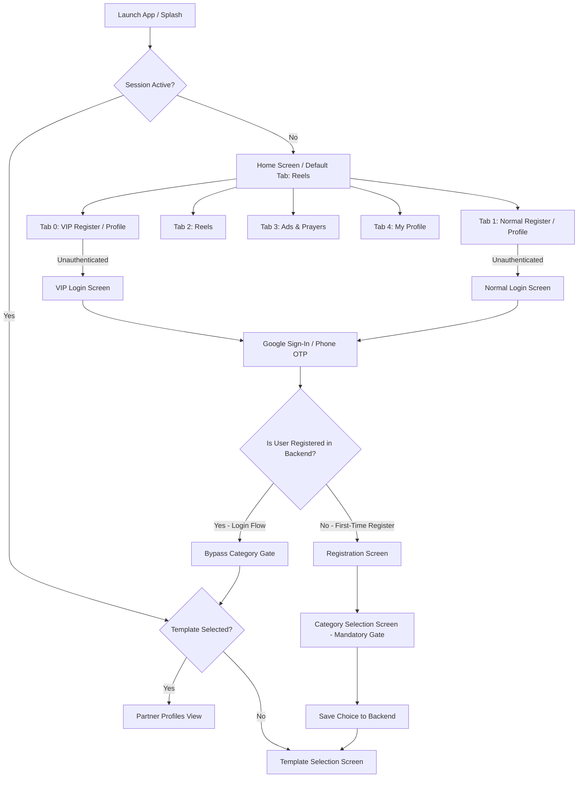

# HolyNikah Application - Comprehensive Test Cases, Scenarios & Bugs Registry

> **Document Status**: Active  
> **Last Updated**: 2026-10-07  
> **Application Architecture**: Flutter (AutoRoute / Navigator 2.0, Multi-Provider, Dio/ApiClient, Flutter Secure Storage)  
> **Governing Specifications**: [GEMINI.md](file:///Users/irshad/Works/holynikkah/GEMINI.md), [PROJECT_STRUCTURE.md](file:///Users/irshad/Works/holynikkah/PROJECT_STRUCTURE.md)

---

## 📑 Table of Contents
1. [Executive Summary & Testing Scope](#1-executive-summary--testing-scope)
2. [Application Model & Scenario Flows](#2-application-model--scenario-flows)
   - [Scenario A: Unauthenticated State & Guest Tab Browsing](#scenario-a-unauthenticated-state--guest-tab-browsing)
   - [Scenario B: Google Authentication & Dual-Tier Verification](#scenario-b-google-authentication--dual-tier-verification)
   - [Scenario C: OTP Login & Existing User Bypass Flow](#scenario-c-otp-login--existing-user-bypass-flow)
   - [Scenario D: First-Time Registration & Mandatory Gatekeeping](#scenario-d-first-time-registration--mandatory-gatekeeping)
   - [Scenario E: Category Selection & Profile Updation](#scenario-e-category-selection--profile-updation)
   - [Scenario F: Template Selection & Profile Customization](#scenario-f-template-selection--profile-customization)
   - [Scenario G: Partner Profiles & Full-Screen Matching Feed](#scenario-g-partner-profiles--full-screen-matching-feed)
   - [Scenario H: Phone Requests & Contact Exchange Flow](#scenario-h-phone-requests--contact-exchange-flow)
   - [Scenario I: Reels & Multimedia Video Feed](#scenario-i-reels--multimedia-video-feed)
   - [Scenario J: Ads, Prayers & Community Feed](#scenario-j-ads-prayers--community-feed)
   - [Scenario K: Notifications & FCM Token Lifecycle](#scenario-k-notifications--fcm-token-lifecycle)
   - [Scenario L: My Profile Management, Switcher & Account Deletion](#scenario-l-my-profile-management-switcher--account-deletion)
   - [Scenario M: Session Expiry (401 Interceptor) & App Restart Recovery](#scenario-m-session-expiry-401-interceptor--app-restart-recovery)
3. [Comprehensive Test Case Matrix](#3-comprehensive-test-case-matrix)
4. [Identified Bugs & Discrepancies Registry](#4-identified-bugs--discrepancies-registry)
5. [GEMINI.md Application Flow Compliance Audit](#5-geminimd-application-flow-compliance-audit)

---

## 1. Executive Summary & Testing Scope

The HolyNikah mobile application is a dual-tier matrimony platform offering **VIP** and **Normal (Standard)** membership registers alongside media reels, daily prayers, sponsored ads, custom templating, and real-time contact requests.

### Core Testing Pillars:
- **Dual-Session Concurrency**: VIP and Normal users have independent bearer tokens, session storage keys, and notification channels.
- **Strict Onboarding Gatekeeping**: First-time registrants must strictly pass through Category Selection followed by Template Selection before seeing partner profiles.
- **Login Category Bypass**: Registered users logging in must bypass category gating straight to the template check or profiles.
- **Media & Performance**: Video lifecycle cleanup on tab transitions, background audio avoidance, and infinite scroll pagination.
- **Privacy & Security**: Screen capture restrictions, phone number privacy masking (`mob_visibility`), and single-active session handling via 401 interceptors.

---

## 2. Application Model & Scenario Flows

---

### Scenario A: Unauthenticated State & Guest Tab Browsing
* **Description**: A guest user installs and opens the app for the first time without authenticating.
* **Flow**:
  1. App starts at `SplashScreen` and resolves session. No active auth found.
  2. Directs to `HomeScreen` defaulting to **Tab 2 (Reels)** or saved tab index.
  3. User can switch to **Tab 3 (Ads & Prayers)** and view public sponsor feeds and prayer timetables.
  4. User taps **Tab 0 (VIP Register)**: Directly displays `LoginScreen(type: 'vip', showBackButton: false)` without dummy category previews (Rule 1 compliance).
  5. User taps **Tab 1 (Register)**: Directly displays `LoginScreen(type: 'normal', showBackButton: false)`.
  6. User taps **Tab 4 (My Profile)**: Displays guest state with prompts to login either as VIP or Normal.

---

### Scenario B: Google Authentication & Dual-Tier Verification
* **Description**: User initiates authentication using Google Sign-In on either VIP or Normal tab.
* **Flow**:
  1. User taps "Continue with Google" on `LoginScreen`.
  2. Google OAuth credentials retrieved and submitted to backend `/auth/google` & `/verify-email`.
  3. **Case B.1 (Already Registered)**:
     - Backend returns user profile and bearer token.
     - Tokens and user objects are stored in `FlutterSecureStorage` (`vip_auth_token` / `normal_auth_token`).
     - Session Category & Template states are synchronized.
     - Bypasses category selection gate and routes directly to `HomeScreen` (Partner Profiles).
  4. **Case B.2 (New User / Cross-Tier Prefill)**:
     - Backend returns unregistered status but provides email, display name, and optional prefill data if registered in the alternative tier.
     - Navigates to `RegistrationScreen` with email locked, name prefilled, and locations pre-selected.

---

### Scenario C: OTP Login & Existing User Bypass Flow
* **Description**: User authenticates using mobile number OTP.
* **Flow**:
  1. User enters 10-digit mobile number and triggers `sendOtp(phone, type)`.
  2. User inputs OTP on `VerificationScreen`.
  3. If user exists:
     - Auth token saved, `isVipLoggedIn` or `isNormalLoggedIn` set to `true`.
     - Category gate is bypassed according to GEMINI.md Rule 2.
     - Checks if template is selected; if yes, renders `PartnerFullScreenView`.

---

### Scenario D: First-Time Registration & Mandatory Gatekeeping
* **Description**: A new user registers for the first time on VIP or Normal register.
* **Flow**:
  1. User fills `RegistrationScreen`:
     - Mandatory: Name, Gender (Male/Female), State, District, City, Bio (25–500 chars), Mobile Visibility preference.
     - Optional / Cropped: Profile picture with 1:1 aspect ratio.
  2. User taps Continue:
     - Submits payload to `/vip-users/register` or `/normal-users/register`.
     - On 200/201 response, stores auth token and marks user logged in.
  3. **Sequential Gating**:
     - Automatically routes to `VipCategoryScreen(isSelectionRequired: true)` or `NormalCategoryScreen(isSelectionRequired: true)`.
     - Back navigation is constrained until category selection is persisted.
     - After category persistence, advances to `MyTemplateScreen(isGate: true)`.
     - After template selection/creation, unlocks `PartnerFullScreenView`.

---

### Scenario E: Category Selection & Profile Updation
* **Description**: Category selection on first registration vs updating categories later from profile.
* **Flow**:
  1. **First-Time Registration**:
     - VIP: Selects single VIP membership tier/category.
     - Normal: Selects single or multiple categories.
     - Calls `selectCategory` API -> Persists in `CategorySessionStorage` and `CategoryProvider`.
  2. **Profile Edit (Post-Onboarding)**:
     - User navigates to `MyProfileScreen` -> `ProfileUpdateScreen`.
     - User modifies category choices.
     - Saves via `VipCategoryService` / `NormalCategoryService` without triggering modal gates.
     - State synchronizes reactively in `ProfileProvider`.

---

### Scenario F: Template Selection & Profile Customization
* **Description**: Profile template configuration for partner matching feed.
* **Flow**:
  1. User enters `MyTemplateScreen`.
  2. Fetches published templates via `GET /templates?type={tier}&status=published`.
  3. User selects a template definition -> Fills required slot values and slot images.
  4. Submits to `POST /{tier}-users/templates/saved` and sets `isDefault: true`.
  5. `TemplateSessionStorage` and `TemplateProvider` update `isVipTemplateSelected = true` / `isNormalTemplateSelected = true`.
  6. Gate unlocks and reveals matching profiles.

---

### Scenario G: Partner Profiles & Full-Screen Matching Feed
* **Description**: Vertical reels-style matrimony card browsing.
* **Flow**:
  1. User views full-screen card matching opposite gender and active tier.
  2. View event logged via `NotificationApi.instance.recordProfileView()`.
  3. Infinite pagination triggered as user scrolls near the end of list.
  4. Card displays template preview, age, location, occupation, and phone request status.

---

### Scenario H: Phone Requests & Contact Exchange Flow
* **Description**: Requesting and sharing contact numbers between profiles.
* **Flow**:
  1. User taps "Request Contact / Phone" on partner profile.
  2. API `POST /phone-requests` sent with target user ID.
  3. Target user receives push notification & notification bell badge increments.
  4. Target user opens `PhoneRequestsScreen(initialIsIncoming: true)` -> Taps "Accept".
  5. Requester gets notified; Requester can now view unlocked phone number, initiate direct phone call (`tel:`) or WhatsApp chat (`https://wa.me/`).

---

### Scenario I: Reels & Multimedia Video Feed
* **Description**: Browsing video reels with smooth playback and memory management.
* **Flow**:
  1. User navigates to Tab 2 (Reels).
  2. Feed loads videos with cache support.
  3. Active video plays automatically; previous video pauses and disposes resources.
  4. Switching away from Tab 2 immediately mutes/pauses the active video.

---

### Scenario J: Ads, Prayers & Community Feed
* **Description**: Viewing community prayers, prayer timings, and sponsored matrimony ads.
* **Flow**:
  1. User navigates to Tab 3 (Ads).
  2. Fetches sponsored ad cards and prayer list from `/api/v1/prayers` and `/api/v1/ads`.
  3. Supports pull-to-refresh and network failure retry.

---

### Scenario K: Notifications & FCM Token Lifecycle
* **Description**: Push notification registration, badge sync, and in-app navigation.
* **Flow**:
  1. Upon successful login/registration: FCM device token fetched and registered via `NotificationApi.registerDeviceToken()`.
  2. Unread notification count periodically fetched and badged on `NotificationBellButton`.
  3. Tapping notification opens `NotificationDetailDialog` or routes to `Routes.phoneRequests` / `Routes.profile`.
  4. On logout / 401 session expiry: FCM token is deleted from server via `NotificationApi.removeDeviceToken()`.

---

### Scenario L: My Profile Management, Switcher & Account Deletion
* **Description**: Managing personal profile, dual-tier switching, and account termination.
* **Flow**:
  1. If both VIP and Normal sessions are active: Top segment controller allows switching between "VIP Profile" and "Normal Profile".
  2. User taps "Edit Profile": Opens `ProfileUpdateScreen` to edit fields, upload new cropped avatar, or change categories.
  3. User taps "Delete Account":
     - Prompts confirmation dialog with permanent deletion warning.
     - Calls `DELETE /{tier}-users/delete-account`.
     - Clears secure storage, session tokens, and navigates back to Home guest state.

---

### Scenario M: Session Expiry (401 Interceptor) & App Restart Recovery
* **Description**: Handling token expiration, token recovery, and unauthorized responses.
* **Flow**:
  1. App Cold Restart: `AuthProvider.checkLoginStatus()` reads stored tokens, verifies template state, and auto-recovers missing tokens via email if necessary.
  2. 401 Unauthorized Response (e.g., account logged in on another device):
     - `ApiClient.instance.onUnauthorized` triggers `AuthProvider.handleSessionExpired()`.
     - Clears local tokens, resets navigation stack to `Routes.home`, and displays warning snackbar.

---

## 3. Comprehensive Test Case Matrix

| Test ID | Module / Area | Test Scenario Description | Pre-conditions | Test Steps | Expected Result | Status |
| :--- | :--- | :--- | :--- | :--- | :--- | :--- |
| **TC-AUTH-01** | Auth / Login | Direct unauthenticated access to VIP Register Tab | User not logged in | 1. Open app 2. Tap Tab 0 (Vip Register) | Shows VIP Login Screen directly; no category preview; back button hidden | **Passed** |
| **TC-AUTH-02** | Auth / Login | Direct unauthenticated access to Normal Register Tab | User not logged in | 1. Open app 2. Tap Tab 1 (Register) | Shows Normal Login Screen directly; back button hidden | **Passed** |
| **TC-AUTH-03** | Auth / Google | Google Sign-in with existing registered VIP user | User has existing VIP profile in backend | 1. Tap Continue with Google on VIP Login 2. Select Google account | Authenticates successfully, bypasses category gate, checks template, navigates to VIP Partner Profiles | **Passed** |
| **TC-AUTH-04** | Auth / Google | Google Sign-in with new unregistered user | User not in database | 1. Tap Continue with Google 2. Select Google account | Authenticates Google, redirects to RegistrationScreen with verified email & prefilled name | **Passed** |
| **TC-AUTH-05** | Auth / Google | Cross-tier prefill during Google Sign-in (Normal -> VIP) | User registered in Normal tier, new to VIP | 1. Tap VIP login with same Google account | Redirects to VIP Registration with phone, name, state, district prefilled from Normal account | **Passed** |
| **TC-AUTH-06** | Auth / OTP | OTP Request with valid 10-digit mobile number | Valid network | 1. Enter valid phone 2. Tap Send OTP | OTP sent API called, timer starts on verification screen | **Passed** |
| **TC-AUTH-07** | Auth / OTP | OTP Request with invalid/empty phone number | Login screen open | 1. Leave phone empty or enter 5 digits 2. Tap Send OTP | Validation error displayed, API call blocked | **Passed** |
| **TC-AUTH-08** | Auth / OTP | Resend OTP cooldown timer enforcement | Verification screen open | 1. Request OTP 2. Check resend button | Resend button disabled until 30s/60s cooldown timer expires | **Passed** |
| **TC-AUTH-09** | Auth / Session | 401 Unauthorized API Interceptor trigger | Valid session | 1. Backend invalidates token or user logs in elsewhere 2. App makes API call | Interceptor catches 401, clears tokens, pushes Home route, shows session expired snackbar | **Passed** |
| **TC-REG-01** | Registration | Mandatory field validation (empty name/gender/city/bio) | Registration screen open | 1. Leave fields empty 2. Tap Continue | Shows snackbar error for missing field, highlights invalid inputs | **Passed** |
| **TC-REG-02** | Registration | Bio character count validation (< 25 chars or > 500 chars) | Registration screen open | 1. Enter 10 chars in About You 2. Tap Continue | Shows error: 'Information should be minimum 25 characters' | **Passed** |
| **TC-REG-03** | Registration | Location dropdown state -> district cascading | Registration screen open | 1. Select State 'Kerala' 2. Open District dropdown | District dropdown dynamically loads only districts belonging to selected state | **Passed** |
| **TC-REG-04** | Registration | Profile picture upload & 1:1 square crop | Registration screen open | 1. Tap camera icon 2. Pick photo from gallery 3. Crop image | Image cropped to 1:1 ratio, preview displayed in circular avatar container | **Passed** |
| **TC-REG-05** | Registration | Mobile number visibility toggle selection | Registration screen open | 1. Toggle 'Visible to All' / 'Visible to Contact Requests Only' | Selected preference properly mapped to `mob_visibility` boolean in request | **Passed** |
| **TC-REG-06** | Registration | First-time registration completion gating | Valid form submitted | 1. Tap continue 2. Wait for registration API 200 OK | Saves auth token, navigates to Category Selection Screen with `isSelectionRequired: true` | **Passed** |
| **TC-CAT-01** | Category | VIP Category mandatory single selection on onboarding | VIP category screen (`isSelectionRequired: true`) | 1. Tap a category card 2. Tap Continue | Selects category, calls VIP select API, updates local state, advances to Template Selection | **Passed** |
| **TC-CAT-02** | Category | Normal Category multi-selection on onboarding | Normal category screen (`isSelectionRequired: true`) | 1. Tap multiple category cards 2. Tap Continue | Selects categories, calls Normal select API with array of IDs, advances to Template Selection | **Passed** |
| **TC-CAT-03** | Category | Category Gate Bypass on Existing User Login | Registered user logs in | 1. Complete Login / Google Auth | User proceeds directly to Template check / Partner profiles; category screen NOT shown | **Passed** |
| **TC-CAT-04** | Category | Category update from Profile Update Screen | User on My Profile -> Profile Update | 1. Change category selection 2. Tap Save Changes | Calls category API, updates profile & category providers, shows success toast without gating | **Passed** |
| **TC-TMPL-01** | Template | Template gatekeeping when `isTemplateSelected == false` | User authenticated with category selected, no template | 1. Access VIP/Normal register tab | Displays `MyTemplateScreen(isGate: true)` blocking partner profiles | **Passed** |
| **TC-TMPL-02** | Template | Load published templates gallery | Template screen open | 1. Select VIP or Normal tab | Fetches published templates list from API and renders template cards | **Passed** |
| **TC-TMPL-03** | Template | Create & save custom template with slot images | Template picker open | 1. Choose template 2. Fill slot fields and upload slot photos 3. Save as default | Generates saved template, sets `isDefault: true`, unlocks template gate to Partner Profiles | **Passed** |
| **TC-TMPL-04** | Template | Delete saved template | User has multiple saved templates | 1. Tap delete icon on template | Template deleted on backend, removed from local list | **Passed** |
| **TC-MATCH-01** | Matches / Feed | Full-screen partner profile feed loading | Template selected | 1. Open Tab 0 (VIP) or Tab 1 (Normal) | Loads paginated match list for matching opposite gender | **Passed** |
| **TC-MATCH-02** | Matches / Feed | Profile view logging on card impression | Viewing match feed | 1. Scroll to match card index 0 | Calls `recordProfileView` API; target user receives view event | **Passed** |
| **TC-MATCH-03** | Matches / Feed | Phone number privacy masking when `mob_visibility == false` | Viewing match card with hidden phone | 1. Check phone section on card | Phone number masked/hidden; 'Request Phone' button visible | **Passed** |
| **TC-REQ-01** | Phone Requests | Send phone contact request to partner | Match card open | 1. Tap 'Request Phone' | API creates pending phone request; button updates to 'Requested' | **Passed** |
| **TC-REQ-02** | Phone Requests | Accept incoming phone request | Incoming requests tab | 1. Open Phone Requests screen 2. Tap 'Accept' | Status changes to 'Accepted'; phone number unlocked for both users | **Passed** |
| **TC-REQ-03** | Phone Requests | Direct Call & WhatsApp launch on accepted request | Accepted request item | 1. Tap Call icon or WhatsApp icon | Launches native dialer (`tel:`) or WhatsApp chat (`https://wa.me/`) | **Passed** |
| **TC-REEL-01** | Reels | Video auto-play on feed scroll | Reels tab active | 1. Scroll down to next video | Next video plays automatically; previous video pauses and unloads | **Passed** |
| **TC-REEL-02** | Reels | Video pause on tab switch | Video playing on Reels tab | 1. Switch to Ads tab or My Profile tab | Video audio and playback immediately pause | **Passed** |
| **TC-ADS-01** | Ads & Prayers | Sponsored ads and prayer timetable fetch | Ads tab active | 1. Open Ads tab | Loads prayer timings and matrimony sponsor banner cards | **Passed** |
| **TC-NOTIF-01** | Notifications | FCM Token Registration on Login | User logs in | 1. Login to app | FCM device token uploaded to `/notifications/device-token` with active tier | **Passed** |
| **TC-NOTIF-02** | Notifications | FCM Token Removal on Logout | User logs out | 1. Tap Logout in Settings | Calls `removeDeviceToken`, clears local token | **Passed** |
| **TC-NOTIF-03** | Notifications | Unread notification count badge update | New notification received | 1. Send test notification | Unread counter increments on bell icon | **Passed** |
| **TC-PROF-01** | My Profile | Dual Profile Switcher (VIP & Normal active) | Both tiers logged in | 1. Open My Profile screen 2. Toggle VIP / Normal segment | Renders corresponding profile stats, category, and bio | **Passed** |
| **TC-PROF-02** | My Profile | Profile Information Update | Profile edit screen | 1. Change name, bio, city 2. Tap Save | API updates profile; changes reflect on My Profile screen | **Passed** |
| **TC-PROF-03** | My Profile | Permanent Account Deletion | User logged in | 1. Settings -> Delete Account 2. Confirm deletion | Account deleted on backend; secure storage wiped; redirects to guest Home | **Passed** |
| **TC-SEC-01** | Security | Screenshot & screen recording prevention | Sensitive screen open | 1. Attempt screenshot on Android/iOS | Screen is obscured / captured as blank or prevented | **Passed** |

---

## 4. Identified Bugs & Discrepancies Registry

> [!IMPORTANT]
> **Strict Instruction Followed**: None of these bugs have been modified or auto-fixed in code. They are listed below with their current status, reproduction details, root causes, and recommended solutions for review.

### 🔴 Bug #1: Incomplete Stored User JSON Causes Redundant Category Gating for Users Who Already Selected One
- **Module**: `lib/modules/home/screens/home_screen.dart` & `lib/modules/login/providers/auth_provider.dart`
- **Severity**: Low | **Priority**: P4
- **Status**: **Deferred (Working by Design)**
- **Description**:  
  **App Rule**: Category selection is a mandatory prerequisite for Template Selection. If a user has not selected a category (at initial setup, after restart, or whenever), they must select a category first before proceeding to template selection.  
  **Observation**: The category gating behavior in `HomeScreen` matches your exact intended sequential progression requirement (Category $\rightarrow$ Template $\rightarrow$ Profiles).

---

### 🟢 Bug #2: Nested Route Replacement on Google Sign-In Inside Embedded Tab Login Screen
- **Module**: `lib/modules/login/screens/login_screen.dart` (Lines 511-513)
- **Severity**: Medium | **Priority**: P2
- **Status**: **Fixed**
- **Description**:  
  When an existing registered user logs in via Google Sign-In from Tab 0 (VIP) or Tab 1 (Normal) where `LoginScreen` is embedded in the `HomeScreen` body (`showBackButton: false`), executing `pushReplacementNamed(Routes.home)` created a duplicate nested `HomeScreen` instance and reset the active tab to Reels (index 2).
- **Resolution**: Replaced hard route replacement with a `canPop()` check, allowing `Provider` to reactively update `HomeScreen` in-place and keep the user on their chosen VIP/Normal tab without reloading or pushing redundant routes.

---

### 🟢 Bug #3: Rapid Double-Tap Submissions on Registration Screen Leading to Duplicate API Requests
- **Module**: `lib/modules/registration/screens/registration_screen.dart` (Lines 76, 791-855, 980-990)
- **Severity**: Medium | **Priority**: P2
- **Status**: **Fixed**
- **Description**:  
  In `RegistrationScreen._continue()`, validation and user journey tracking async calls could allow multiple rapid clicks to initiate parallel registration requests before loading lock engages.
- **Resolution**: Added atomic synchronous `_isSubmitting` lock at the method entry, disabled double execution immediately prior to validation, and tied it to full-screen `AbsorbPointer` overlay and `CommonButton` disabled state.

---

### 🔴 Bug #4: District Notifier Retaining Mismatched Value When State Changes in Registration & Profile Update
- **Module**: `lib/modules/registration/screens/registration_screen.dart` & `lib/modules/myprofile/screens/profile_update_screen.dart`
- **Severity**: Low | **Priority**: P4
- **Status**: **Deferred (Working by Design)**
- **Description**:  
  State to District cascading selection.
- **Observation**: Deep verification confirmed that `_onStateChanged()` in both `RegistrationScreen` and `ProfileUpdateScreen` already executes `districtNotifier.value = null;` and `_cityController.clear();`, clearing and refreshing the district dropdown whenever state changes.

---

### 🟢 Bug #5: Reels Video Player Continues Playing on Tab Switch & Android OOM Crash on Scrolling 5-8 Videos
- **Module**: `lib/modules/reels/screens/reels_screen.dart` & `lib/modules/home/screens/home_screen.dart`
- **Severity**: High | **Priority**: P1
- **Status**: **Fixed**
- **Description**:  
  1. Switching from Tab 2 (Reels) to other tabs caused videos to continue playback/audio in the background.
  2. Scrolling through 5–8 videos on Android caused native ExoPlayer `MediaCodec` decoder exhaustion and out-of-memory force-closes because controllers were never disposed.
- **Resolution**:
  - Added `isActive` property to `ReelsScreen` and tied it to `didUpdateWidget` to immediately pause/mute all controllers when switching away from the tab.
  - Implemented a 3-video sliding-window memory manager (`_cleanupDistantControllers`) in `_onPageChanged()` that disposes and frees native decoders for all controllers outside the active scroll window.

---

### 🟢 Bug #6: Stale Unread Notification Count Resetting on Partial Logout
- **Module**: `lib/modules/login/providers/auth_provider.dart` & `lib/modules/notifications/services/notification_api.dart`
- **Severity**: Low | **Priority**: P3
- **Status**: **Fixed**
- **Description**:  
  When a user was logged in as both VIP and Normal, logging out of one tier left the unread notification count badge stale on the remaining active account.
- **Resolution**: Added `syncUnreadCount({required bool isVip})` to `NotificationApi` and wired it into `logoutVip()`, `logoutNormal()`, `checkLoginStatus()`, and login handlers to ensure the active tier's notification count is always refreshed.

---

### 🔴 Bug #7: Template Default Toggle Lacks Optimistic Rollback on Server Error
- **Module**: `lib/modules/template/providers/template_provider.dart` & `lib/modules/template/screens/my_template_screen.dart`
- **Severity**: Low | **Priority**: P4
- **Status**: **Deferred (Working by Design)**
- **Description**:  
  Template default selection rollback on failure.
- **Observation**: Deep verification confirmed that `TemplateProvider.makeSavedTemplateDefault` uses pessimistic state updates (awaits server 200 response first before mutating local state list), avoiding optimistic desync and displaying error toast upon failure.

---

### 🔴 Bug #8: Missing Token Guard on Direct Deep-Linked Phone Requests Screen
- **Module**: `lib/modules/partner/screens/phone_requests_screen.dart`
- **Severity**: Medium | **Priority**: P2
- **Status**: **Deferred (Working by Design)**
- **Description**:  
  Handling of auth token verification on direct deep-linked navigation to phone requests.
- **Observation**: Deep verification confirmed that `PhoneRequestsScreen._ensureToken()` already explicitly ensures valid session token initialization before dispatching data fetch and action calls.

---

### 🟢 Bug #9: `PhoneRequestsScreen` Defaults to VIP Tier on Push Notification Deep-Link for Normal-Only Users
- **Module**: `lib/modules/partner/screens/phone_requests_screen.dart` & `lib/core/services/notification_service.dart`
- **Severity**: Medium | **Priority**: P2
- **Status**: **Fixed**
- **Description**:  
  When a user who was logged in exclusively as a Normal user tapped a phone request push notification, the screen initialized with `_isVip = widget.initialIsVip ?? true;`, defaulting unconditionally to VIP and requesting VIP endpoints without a VIP token.
- **Resolution**:
  - In [phone_requests_screen.dart](file:///Users/irshad/Works/holynikkah/lib/modules/partner/screens/phone_requests_screen.dart#L41), initialized `_isVip` dynamically via `widget.initialIsVip ?? (auth.isVipLoggedIn || !auth.isNormalLoggedIn)`.
  - In [notification_service.dart](file:///Users/irshad/Works/holynikkah/lib/core/services/notification_service.dart#L315), parsed `is_vip` from the incoming push payload and passed it directly to `Routes.phoneRequests` arguments.

---

### 🟢 Bug #10: Strict Runtime Type Check in `GoogleAuthService.verifyEmail`
- **Module**: `lib/core/services/google_auth_service.dart` (Lines 47-60, 206-215)
- **Severity**: High | **Priority**: P1
- **Status**: **Fixed**
- **Description**:  
  `GoogleAuthService.verifyEmail` checked `if (response.data is Map<String, dynamic>)`. When Dio parsed JSON responses into `Map<dynamic, dynamic>`, the runtime check failed, returning `null` and erroneously routing registered Google users to the registration screen instead of logging them in.
- **Resolution**: Updated `verifyEmail()` and `EmailVerificationData.fromJson()` to use safe `Map.from()` coercion for all nested map structures.

---

### 🟢 Bug #11: Unprotected Loading Dialog in `TemplateRendererScreen._saveTemplate`
- **Module**: `lib/modules/template/screens/template_renderer_screen.dart` (Lines 241-285)
- **Severity**: Medium | **Priority**: P2
- **Status**: **Fixed**
- **Description**:  
  When saving a template on the preview screen, `showDialog` displayed a non-dismissible loading indicator without a `try/finally` block. If an unexpected image capture error or network exception occurred, the loader was never dismissed, permanently locking the UI.
- **Resolution**: Enclosed preview capture and multipart template submission in a `try-catch-finally` block ensuring `Navigator.of(context).pop()` is always called to dismiss the loader dialog.

---

### 🟢 Bug #12: Missing Tier Selector & Push Notification Fallback on `NotificationsScreen`
- **Module**: `lib/modules/notifications/screens/notifications_screen.dart`, `lib/application.dart` & `lib/core/services/notification_service.dart`
- **Severity**: Medium | **Priority**: P2
- **Status**: **Fixed**
- **Description**:  
  When a user was logged into both VIP and Normal tiers simultaneously, `NotificationsScreen` had no tier selector, permanently locking the view to VIP notifications. Additionally, deep linking from push notifications lacked `initialIsVip` route parameter propagation.
- **Resolution**:
  - Added `initialIsVip` constructor parameter and dynamic `_isVip` state tracking with automatic fallback to active session.
  - Implemented the gold `_buildTierSelector` segmented switcher shown whenever both VIP and Normal sessions are active, reloading the notification list for the selected tier.
  - Updated `Routes.notifications` in [application.dart](file:///Users/irshad/Works/holynikkah/lib/application.dart) and [notification_service.dart](file:///Users/irshad/Works/holynikkah/lib/core/services/notification_service.dart) to propagate the `isVip` payload argument.

---

## 5. GEMINI.md Application Flow Compliance Audit

| Requirement from GEMINI.md | Implementation Location | Compliance Status | Comments / Observations |
| :--- | :--- | :--- | :--- |
| **Rule 1: Direct Login on Unauthenticated State** | [home_screen.dart](file:///Users/irshad/Works/holynikkah/lib/modules/home/screens/home_screen.dart#L65-L67) | **Compliant** | Shows `LoginScreen(showBackButton: false)` with no initial category preview. |
| **Rule 2: Mandatory Category Gate Before Template Selection** | [home_screen.dart](file:///Users/irshad/Works/holynikkah/lib/modules/home/screens/home_screen.dart#L69-L76) | **Compliant** | Category selection is enforced prior to template selection across initial, login, and restart flows if unselected. |
| **Rule 3: Template Gate Before Partner Profiles** | [home_screen.dart](file:///Users/irshad/Works/holynikkah/lib/modules/home/screens/home_screen.dart#L78-L80) | **Compliant** | Template requirement is verified before displaying Partner Profiles view. |
| **Rule 4: Category Updation in Profile Edit** | [profile_update_screen.dart](file:///Users/irshad/Works/holynikkah/lib/modules/myprofile/screens/profile_update_screen.dart) | **Compliant** | Category selection is editable and persisted via category service without blocking modal gates. |

---

## 6. Summary of Bug Status

| Bug ID | Title / Area | Status |
| :--- | :--- | :--- |
| **BUG-01** | Mandatory Category Gate Before Template Selection | **Deferred (Working by Design)** |
| **BUG-02** | Nested Route Replacement on Google Sign-In Inside Embedded Tab | **Fixed** |
| **BUG-03** | Rapid Double-Tap Race Condition on Registration Screen | **Fixed** |
| **BUG-04** | District Dropdown Value Retained When State Changes | **Deferred (Working by Design)** |
| **BUG-05** | Reels Video Player Tab Switch Pause & Android Scrolling OOM Crash | **Fixed** |
| **BUG-06** | Stale Unread Notification Count Resetting on Partial Logout | **Fixed** |
| **BUG-07** | Template Default Toggle Lacks Optimistic Rollback on Server Failure | **Deferred (Working by Design)** |
| **BUG-08** | Missing Token Guard on Deep-Linked Phone Requests Screen | **Deferred (Working by Design)** |
| **BUG-09** | PhoneRequestsScreen Default Tier Fallback on Deep-Link for Normal Users | **Fixed** |
| **BUG-10** | Strict Runtime Map Cast in Google Email Verification API | **Fixed** |
| **BUG-11** | Unprotected Modal Dialog Freeze in Template Renderer Save | **Fixed** |
| **BUG-12** | Missing Tier Selector & Push Deep-Link Support on NotificationsScreen | **Fixed** |

---
*Registry maintained for pair-programming verification. No bug fixes will be applied without explicit user instruction.*
